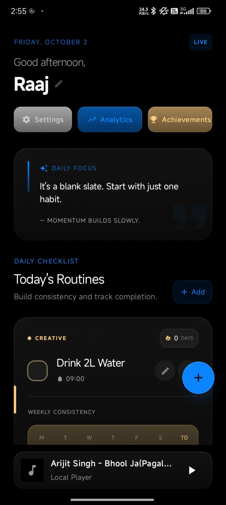
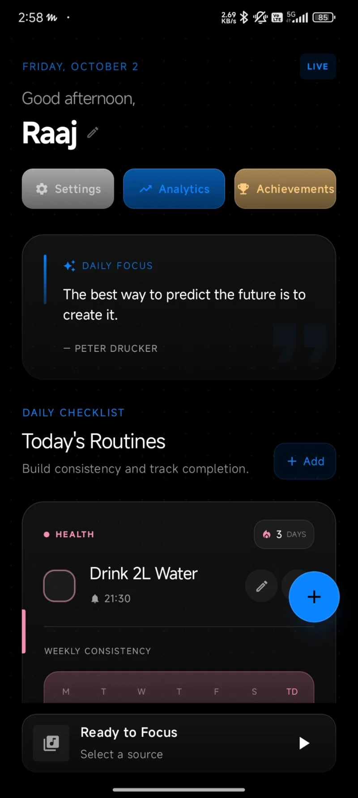

# Rituals

A modern personal productivity platform combining habit tracking, smart reminders, journaling, music and intelligent everyday tools in an offline-first experience.

**Status:** Beta · v25.4 · Active development

## Download
- [Download the APK (v25.4)](https://raajxdev.github.io/portfolio/assets/apps/rituals/Rituals-v25.4.apk) — Android will ask you to allow installs from your browser before installing.
- [Read the case study](https://raajxdev.github.io/portfolio/#project/productivity-app)

## Screenshots

## Screen recordings
- [Life Dashboard overview](media/clip-overview.mp4)
- [Activity calendar & performance charts](media/clip-charts.mp4)

## Tech
Android · Kotlin · Jetpack Compose · MVVM · Firebase · Cloud Firestore · Media3 · WorkManager · AlarmManager

## Being built
Offline-first architecture · Reliable background scheduling · Smart notifications · Habit and productivity tracking · Media playback · AI-assisted functionality · Cloud synchronization

---
Source code is not public yet — this repo is the project's home for the APK, screenshots and updates.
